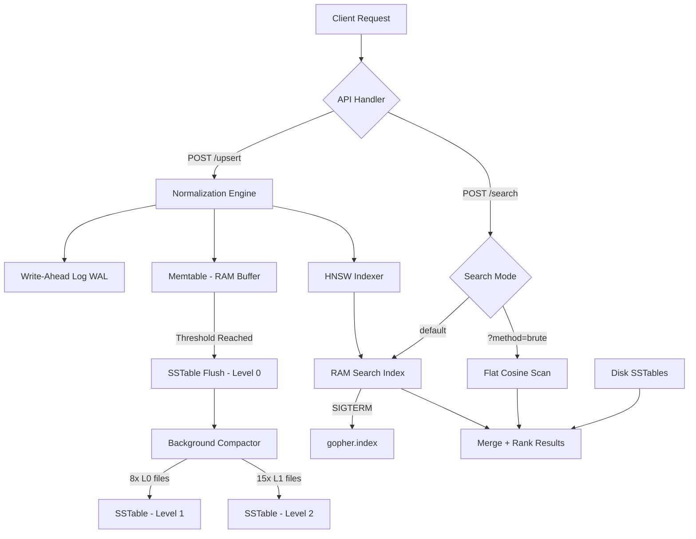
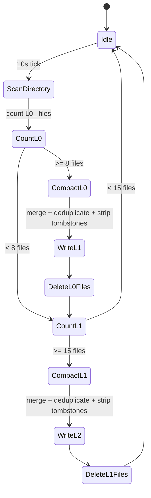
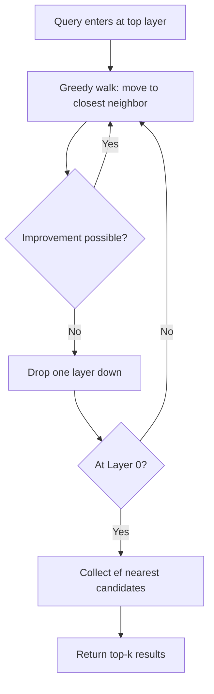
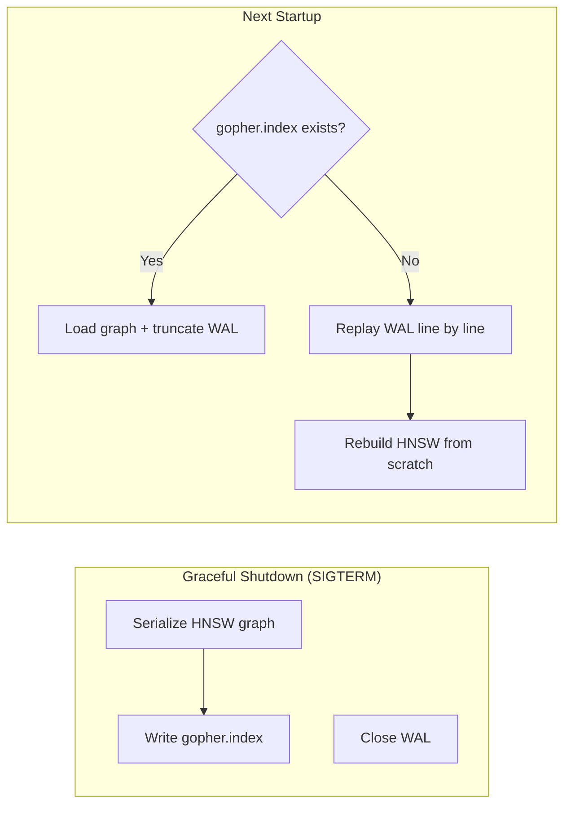

# GopherVectra

GopherVectra is a high-performance vector database engine built in Go. It implements a **Log-Structured Merge-Tree (LSM-Tree)** architecture for persistence and a **Hierarchical Navigable Small World (HNSW)** graph for $O(\log N)$ approximate nearest neighbor search.

The engine is designed around two distinct, non-overlapping responsibilities: a **Write Path** that prioritizes durability and throughput, and a **Search Path** that prioritizes query speed in high-dimensional space. Understanding this separation is the key to understanding the entire codebase.

---

## System Architecture



---

## Project Structure

```
.
├── main.go                        # Entry point, HTTP handlers, graceful shutdown
├── Makefile                       # Dev commands: run, test, clean, status
├── go.mod
├── internal/
│   ├── engine/
│   │   ├── hnsw.go                # HNSW graph: insert, search, delete, persistence
│   │   └── persistence.go
│   └── storage/
│       ├── wal.go                 # Write-Ahead Log: append, replay, crash recovery
│       ├── memtable.go            # In-RAM write buffer with RWMutex
│       ├── sstable.go             # SSTable flush, load, and disk search
│       └── compactor.go          # Background multi-level compaction goroutine
├── pkg/
│   ├── vector/
│   │   ├── types.go               # Vector struct and shared definitions
│   │   └── distance.go            # Normalization and cosine similarity
│   └── bloom/
│       └── filter.go              # Double-hashing Bloom filter for disk lookup
├── api/
│   ├── server.go                  # HTTP handler struct bound to HNSW + WAL
│   └── types.go                   # Request / response DTO definitions
└── scripts/                       # Python bulk ingestion and recall validation
```

---

## Architecture Deep Dive

### 1. The Write Path: LSM-Tree

Traditional databases use a B-Tree for storage, which requires random disk seeks to update records in place. GopherVectra uses an **LSM-Tree (Log-Structured Merge-Tree)**, converting all random writes into fast, sequential disk operations — the same design used by LevelDB, RocksDB, and Apache Cassandra.

```
Write Request
     │
     ▼
┌─────────────────────┐
│  Normalization      │  Scale vector to unit sphere (magnitude = 1.0)
└────────┬────────────┘
         │
         ▼
┌─────────────────────┐
│  Write-Ahead Log    │  Append to gopher.wal before anything else
└────────┬────────────┘
         │
         ├──────────────────────────────────┐
         ▼                                  ▼
┌─────────────────────┐          ┌─────────────────────┐
│  Memtable (RAM)     │          │  HNSW Graph (RAM)   │
│  50-vector buffer   │          │  Probabilistic index│
└────────┬────────────┘          └─────────────────────┘
         │ full?
         ▼
┌─────────────────────┐
│  SSTable Flush      │  Sorted binary .db file on disk
└─────────────────────┘
```

**Step 1 — Normalization**

Before a vector touches disk or the graph, `pkg/vector/distance.go` computes the magnitude across all dimensions and scales every component so the resulting length is exactly 1.0, placing the vector on a unit sphere. After normalization, cosine similarity is mathematically equivalent to a dot product — cheaper and consistent regardless of original embedding scale.

**Step 2 — Write-Ahead Log (WAL)**

Before any in-memory operation, the vector is appended to `gopher.wal`. Each entry is binary-encoded with the following frame layout:

```
┌──────────┬────────────┬──────────┬──────────────────┬──────────┬───────────────┐
│  idLen   │  id bytes  │  dimLen  │  float32 values  │ metaLen  │  meta JSON    │
│ uint32   │  []byte    │ uint32   │  []float32       │ uint32   │  []byte       │
└──────────┴────────────┴──────────┴──────────────────┴──────────┴───────────────┘
```

On startup, the WAL is replayed in full to reconstruct any state lost in a crash. Metadata (including tombstone markers) is preserved across the WAL boundary via JSON encoding.

**Step 3 — Memtable**

After the WAL write, the vector enters the Memtable: a `sync.RWMutex`-protected Go map that serves as the hot in-RAM buffer. Once the Memtable reaches 50 vectors, it triggers a flush.

**Step 4 — SSTable Flush**

The Memtable is sorted by vector ID and written sequentially to an immutable binary `.db` file (a **Sorted String Table**). Each entry encodes its ID length, a tombstone flag, the vector dimension count, and the raw float32 values. Once written, SSTables are never modified — all updates and deletes arrive as new entries.

---

### 2. Bloom Filters for Disk Lookup

Every SSTable on disk is paired with an in-memory **Bloom filter** (`pkg/bloom/filter.go`). Before scanning any `.db` file, the engine queries the filter to determine whether a given ID could possibly exist in that file. If the filter says no, the file is skipped entirely with zero disk I/O.

```
Lookup: "vec_42"
    │
    ▼
┌──────────────────────────────┐
│  Bloom Filter (in RAM)       │
│  MightContain("vec_42")?     │
└────────┬─────────────────────┘
         │
    No ──┘──── Skip file entirely (zero disk I/O)
         │
    Yes ─▼──── Open .db file and scan
```

The filter uses **double hashing** (FNV-64a split into two 32-bit values) with `k` hash functions derived from the target false-positive rate `p` and expected element count `n`:

```
m = -n * ln(p) / ln(2)^2    (bit array size)
k =  m / n * ln(2)          (number of hash functions)
```

Bloom filters are rebuilt on SSTable load and kept in the package-level `ActiveFilters` map keyed by filename, so they survive across compaction cycles.

---

### 3. The Maintenance Layer: Multi-Level Compaction

Under sustained write load, Level 0 accumulates many small `.db` files. Scanning many small files is slower than one large file, and the OS enforces hard limits on open file descriptors. The background Compactor (`internal/storage/compactor.go`) solves this automatically on a 10-second tick.



**Compaction steps:**

1. All Level N files are loaded into memory.
2. Maps are merged — later writes overwrite earlier ones for the same ID (last-write-wins).
3. Tombstoned entries are stripped from the merged map before writing.
4. The result is written as a single Level N+1 SSTable.
5. All Level N source files and their Bloom filters are deleted from `ActiveFilters`.

This is the self-healing property of the engine: it continuously converges toward an optimal storage layout without external intervention.

---

### 4. The Search Path: HNSW Graph

Finding the nearest vector in 768-dimensional space across millions of entries — in milliseconds — is solved by **HNSW (Hierarchical Navigable Small World)**, implemented in `internal/engine/hnsw.go`.

**Probabilistic Layer Assignment**

When a vector is inserted, the engine samples from an exponential distribution to determine its maximum layer:

```
level = floor(-ln(rand()) * ML)     where ML = 1 / ln(M)
```

```
Layer 3  ──●──────────────────────●──          (very sparse, express lane)
Layer 2  ──●────────●─────────────●──●──
Layer 1  ──●──●─────●──●──────────●──●──●──
Layer 0  ──●──●──●──●──●──●──●──●──●──●──●──  (every vector)
```

Most vectors live only in Layer 0. A node at Layer 3 also exists in Layers 2, 1, and 0 — forming a navigable hierarchy.

**Search Traversal**



This hierarchy reduces search complexity from $O(N)$ (brute-force) to $O(\log N)$.

**Unified Search: RAM + Disk**

The `/search` endpoint queries both the HNSW graph (RAM) and all SSTables on disk, then merges and re-ranks by cosine score before returning the top-k:

```
Query Vector
     │
     ├──────────────────────────────────┐
     ▼                                  ▼
┌─────────────┐                ┌──────────────────┐
│ HNSW Search │                │ SSTable Search   │
│ (RAM index) │                │ (all .db files)  │
└──────┬──────┘                └────────┬─────────┘
       │                                │
       └──────────────┬─────────────────┘
                      ▼
             ┌─────────────────┐
             │  Deduplicate    │
             │  Re-rank scores │
             │  Return top-k   │
             └─────────────────┘
```

---

### 5. Persistence and Crash Recovery



On graceful shutdown triggered by `SIGTERM`, the complete HNSW graph — all nodes, vector data, and inter-node links across all layers — is written to `gopher.index` using raw binary encoding (`encoding/binary`). The format is self-contained: no WAL replay is needed to restore the graph.

On the next startup, if `gopher.index` loads successfully, the WAL is immediately truncated to empty. The index is now the source of truth and the WAL starts fresh for the current session only. This keeps crash recovery fast — in the worst case the WAL holds at most one session of writes, not the entire history of the database. If the index file is absent or corrupt, the engine falls back to replaying the WAL from scratch.

---

### 6. Concurrency Model

```
Read operations  (Search, Status)  ──► sync.RWMutex.RLock()   ─► unlimited concurrent readers
Write operations (Upsert, Delete)  ──► sync.RWMutex.Lock()    ─► serialized, safe mutation
```

All HNSW operations and Memtable accesses are protected by `sync.RWMutex`. Read operations acquire a shared lock, allowing unlimited concurrent readers. Write operations acquire the exclusive lock, serializing mutations while reads continue on other goroutines.

---

### 7. Reliability and Accuracy Validation

HNSW is an **Approximate** Nearest Neighbor (ANN) algorithm. To quantify accuracy, the `/search` endpoint exposes a `?method=brute` toggle that bypasses the graph and performs a full flat scan — computing exact cosine similarity against every stored vector. This serves as ground truth.

**Recall measurement:**

$$Recall = \frac{| \text{Neighbors found by HNSW} \cap \text{Neighbors found by Brute Force} |}{K}$$

Example: query for `K=5`, brute force returns `[A, B, C, D, E]`, HNSW returns `[A, B, X, D, E]` — recall is **80%**.

During testing with 1000 768-dimensional vectors, GopherVectra achieved **100% recall** at `M=16`, `Ef=40`.

---

## Benchmark Results

Tested on a ZenBook (Intel amd64, AVX2+FMA) with 1000 vectors of 768 dimensions, 10 concurrent users, 500 queries after a 50-query warmup.

| Parameter | Value |
|-----------|-------|
| Vectors | 1000 |
| Dimensions | 768 |
| M | 16 |
| Ef | 40 |
| Concurrent users | 10 |

| Metric | Result |
|--------|--------|
| Throughput | 39.74 QPS |
| Avg Latency | 247.49 ms |
| Median Latency | 244.26 ms |
| P95 Latency | 305.02 ms |
| P99 Latency | 355.51 ms |
| Min / Max | 154.22 ms / 371.69 ms |
| Success Rate | 100% |
| Recall Accuracy | 100% |

**Optimization history** — all improvements made to the same codebase:

| Stage | QPS | Avg Latency | Recall |
|-------|-----|-------------|--------|
| Baseline (sort on every iteration) | 5 | 2000 ms | 100% |
| Two-heap search traversal | 18 | 527 ms | 100% |
| Eliminated redundant dot products | 31 | 315 ms | 100% |
| Simplified scalar dot product | 39 | 247 ms | 100% |

---

## API Reference

### `POST /upsert`

Normalizes and indexes a vector. Written to WAL, inserted into HNSW graph, and buffered in the Memtable. Triggers an SSTable flush when the Memtable threshold is reached. If the RAM node limit (500) is reached, the oldest vector is evicted from the graph before insertion.

```json
// Request
{
  "id": "vec_001",
  "values": [0.1, -0.2, "... 768 floats"],
  "metadata": { "source": "documents" }
}

// Response 201
{ "status": "success", "id": "vec_001" }
```

---

### `POST /search`

Traverses the HNSW graph and merges disk SSTable results to find the top `k` nearest neighbors. Append `?method=brute` for an exact flat scan.

```json
// Request
{ "values": [0.1, -0.2, "... 768 floats"], "k": 5 }

// Response
[
  { "id": "vec_001", "score": 0.9871, "metadata": { "source": "documents" } },
  { "id": "vec_043", "score": 0.9712, "metadata": {} }
]
```

---

### `DELETE /delete?id=<vector_id>`

Soft-deletes a vector from the HNSW graph and writes a tombstone entry to the WAL and Memtable. The tombstone propagates to disk on the next flush and is purged on the next compaction pass.

```json
{ "status": "deleted", "id": "vec_001", "from_ram": true, "from_disk": false }
```

---

### `GET /status`

Returns real-time engine metrics including uptime, storage state, and HNSW graph internals.

```json
{
  "database_name": "GopherVectra",
  "uptime": "3m42s",
  "storage": {
    "vectors_in_ram": 12,
    "max_ram_limit": 500,
    "memtable_size": 8
  },
  "hnsw_metrics": {
    "max_layer": 4,
    "entry_node": 0
  }
}
```

---

## Makefile

| Command          | Description                                      |
|------------------|--------------------------------------------------|
| `make run`       | Start the server via `go run main.go`            |
| `make test-brute`| Run the Python recall validation suite           |
| `make clean`     | Delete all `.wal`, `.index`, and `.db` files     |
| `make status`    | `curl` the `/status` endpoint                    |
| `make bulk`      | Run the Python bulk vector ingestion script      |
| `make indexdel`  | Delete only the `.index` file, keep data files   |

---

## Running the Validation

```bash
# Fast approximate search via HNSW graph
curl -X POST http://localhost:8080/search \
  -H "Content-Type: application/json" \
  -d '{"values": [...], "k": 5}'

# Exact ground truth search via brute force flat scan
curl -X POST "http://localhost:8080/search?method=brute" \
  -H "Content-Type: application/json" \
  -d '{"values": [...], "k": 5}'
```

Compare the `id` fields across both responses to compute recall manually, or run the automated suite:

```bash
make test-brute
```
