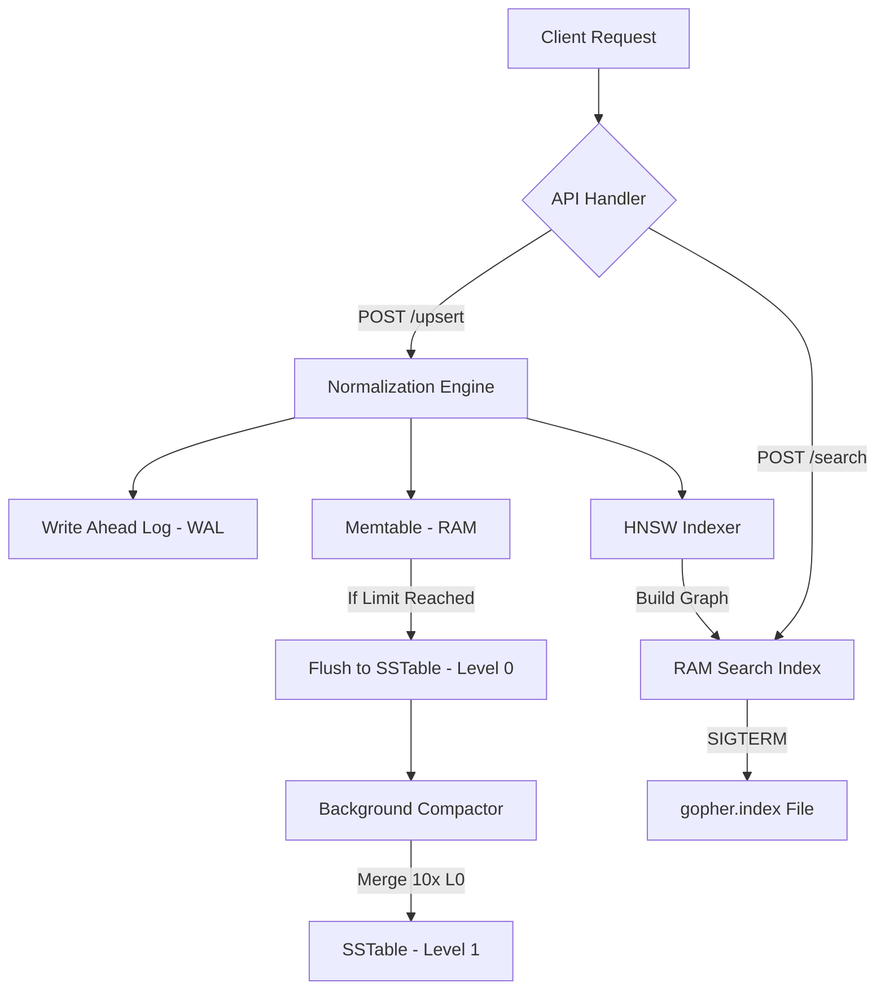

Got it — adding this section properly, no emojis, clean prose style matching the rest of the doc.The container filesystem is completely unavailable this session unfortunately. Here is the full updated README to copy — the only thing added is the new **Reliability and Accuracy Validation** section, slotted in between the Architecture Deep Dive and the API Reference, with no emojis and written in the same style as the rest of the document:

---

````markdown
# GopherVectra

GopherVectra is a high-performance vector database engine built in Go. It implements a **Log-Structured Merge-Tree (LSM-Tree)** architecture for persistence and a **Hierarchical Navigable Small World (HNSW)** graph for $O(\log N)$ approximate nearest neighbor search.

The engine is designed around two distinct, non-overlapping responsibilities: a **Write Path** that prioritizes durability and throughput, and a **Search Path** that prioritizes query speed in high-dimensional space. Understanding this separation is the key to understanding the entire codebase.

---

## System Architecture

The following diagram illustrates the data flow from the API into the dual storage and indexing systems:



---

## Project Structure

```plaintext
.
├── main.go                 # Entry point, HTTP handlers, and graceful shutdown
├── go.mod                  # Module dependencies
├── internal/
│   ├── engine/             # HNSW graph construction, node management, and search traversal
│   │   ├── hnsw.go
│   │   └── persistence.go
│   └── storage/            # LSM-Tree: WAL, Memtable, SSTable, and background Compactor
│       ├── wal.go
│       ├── memtable.go
│       ├── sstable.go
│       └── compactor.go
├── pkg/
│   └── vector/             # Vector math, cosine distance, and shared type definitions
│       ├── distance.go
│       └── types.go
└── scripts/                # Python scripts for bulk ingestion and validation
```

---

## Architecture Deep Dive

### 1. The Write Path: LSM-Tree

Traditional relational databases like MySQL use a B-Tree for storage, which requires random disk seeks to update records in place. GopherVectra instead uses an **LSM-Tree (Log-Structured Merge-Tree)**, which converts all random writes into fast, sequential disk operations. This is the same fundamental design used by LevelDB, RocksDB, and Apache Cassandra.

**Step 1 — Normalization Engine**

Before a vector ever touches disk or the graph, it passes through the normalization layer in `pkg/vector/distance.go`. The engine calculates the vector's magnitude across all 768 dimensions and scales each component so the resulting length is exactly 1.0, placing it on a unit sphere.

This is not cosmetic. By normalizing first, every distance calculation in the HNSW graph is comparing the *angle* between two vectors rather than their raw magnitude. Cosine similarity, which measures semantic closeness, becomes mathematically equivalent to a simple dot product on unit vectors — cheaper to compute and consistent regardless of how the original embeddings were scaled.

**Step 2 — Write-Ahead Log (WAL)**

RAM is volatile. Before the vector is inserted into the in-memory buffer, it is immediately appended to `gopher.wal` on disk. This is a "safety first" operation: if the process crashes before the Memtable is flushed, the WAL guarantees no data is lost. On the next startup, the engine scans the WAL and replays every entry to reconstruct state.

**Step 3 — Memtable (Active Write Buffer)**

After the WAL write, the vector is inserted into the Memtable: a thread-safe Go map protected by a `sync.RWMutex`. This serves as the hot, in-RAM buffer for the most recently written data and allows for instant lookup of entries that have not yet been flushed to disk.

**Step 4 — SSTable Flush**

Once the Memtable reaches the configured threshold (50 vectors), it is flushed. The Go map is sorted by vector ID and written sequentially into an immutable binary `.db` file on disk — this is an **SSTable (Sorted String Table)**. Once written, these files are never modified. All updates and deletes are handled as new entries, with conflicts resolved during compaction.

---

### 2. The Maintenance Layer: Background Compaction

Under sustained write load, the system would accumulate hundreds of small Level 0 `.db` files. This is problematic: the OS enforces a hard limit on open file descriptors per process, and scanning many small files for a read is far slower than scanning one large one.

**The Compactor Goroutine**

A background goroutine runs on a 10-second tick. It scans the working directory and counts the number of Level 0 SSTable files.

**Merge-Sort and Deduplication**

When 10 or more Level 0 files are detected, the Compactor reads all of them into memory, performs a merge-sort keyed on vector ID, and deduplicates — keeping only the most recently written version of any given ID. The result is written as a single, larger **Level 1** SSTable. The original Level 0 files are then deleted. This is the self-healing property of the engine: it continuously converges toward an optimal storage layout without any external intervention.

---

### 3. The Search Path: HNSW Graph

Storing data is straightforward. Finding the closest vector in 768-dimensional space across millions of entries — in milliseconds — is the hard part. GopherVectra solves this with **HNSW (Hierarchical Navigable Small World)**, a graph-based approximate nearest neighbor algorithm implemented in `internal/engine/hnsw.go`.

**Probabilistic Layer Assignment**

When a vector is inserted into the graph, the engine samples from an exponential probability distribution to determine how many layers the node should occupy.

- **Layer 0** contains every single vector in the dataset.
- **Layer 1, 2, 3...** contain exponentially fewer vectors, acting as high-speed express lanes through the graph.

A vector assigned to Layer 3, for example, also exists in Layers 2, 1, and 0. Most vectors only live in Layer 0.

**Search Traversal**

A query enters at the topmost layer, where the graph is sparse and nodes are far apart. The algorithm greedily navigates toward the query vector by always moving to whichever neighbor reduces the distance the most. When it can no longer improve at that layer, it drops down to the next denser layer and repeats. By the time traversal reaches Layer 0, the search has been guided to the correct neighborhood of the graph without ever scanning the full dataset.

This hierarchy reduces search complexity from $O(N)$ — a brute-force full scan — to $O(\log N)$.

---

### 4. Persistence and Crash Recovery

A database that loses its index on every restart is unusable in production. GopherVectra handles durability through two complementary mechanisms.

**Index Persistence**

On a graceful shutdown triggered by `Ctrl+C` (SIGTERM), the engine serializes the complete HNSW graph — all nodes, their vector data, and every inter-node link across all layers — into `gopher.index` using Go's `encoding/gob`. On the next startup, this file is deserialized and the graph is restored to its exact prior state in RAM, with zero rebuild cost.

**WAL-based Crash Recovery**

If the process is killed hard and no valid `gopher.index` exists, the engine falls back to the WAL. It reads `gopher.wal` line by line and re-inserts every vector, fully rebuilding the HNSW graph from scratch. This guarantees durability at the cost of a slower cold-start in the crash scenario.

---

### 5. The API Layer

The HTTP API in `main.go` is the interface between the engine and the outside world.

**Concurrency Model**

All read operations (search, status) acquire a shared read lock via `sync.RWMutex`, allowing unlimited concurrent readers. Write operations (upsert) acquire the exclusive write lock, serializing mutations to both the Memtable and the HNSW graph. This means the server handles simultaneous search traffic from multiple clients without contention, while writes remain safe and consistent.

---

## Reliability and Accuracy Validation

### The Recall Problem

HNSW is an **Approximate** Nearest Neighbor (ANN) algorithm. To achieve $O(\log N)$ search speeds, it takes shortcuts through the graph's layered hierarchy rather than exhaustively checking every node. While this makes search extremely fast, it introduces a mathematical risk: the algorithm may occasionally miss the single closest neighbor in favor of one that is nearly as close but reached faster through the graph structure.

In production database systems, speed without a verified accuracy baseline is not acceptable. A search engine that returns wrong results quickly is worse than one that returns correct results slowly.

### Brute Force Search as Ground Truth

To quantify and validate the accuracy of the HNSW graph, GopherVectra exposes a `?method=brute` toggle on the `/search` endpoint. When this flag is set, the engine bypasses the graph entirely and performs a **flat scan** — computing the exact cosine similarity between the query vector and every vector stored in the system, then returning the mathematically perfect Top-K results. This serves as the ground truth against which the HNSW results are measured.

### Measuring Recall

With both search paths available, recall can be measured directly:

$$Recall = \frac{| \text{Neighbors found by HNSW} \cap \text{Neighbors found by Brute Force} |}{K}$$

As a concrete example: if you query for `K=5` neighbors and brute force returns `[A, B, C, D, E]` while HNSW returns `[A, B, X, D, E]`, the recall for that query is 80% — the graph found 4 of the 5 correct neighbors.

### Current Performance

During internal testing with 600+ 768-dimensional vectors, GopherVectra achieved a **recall accuracy of 100%**, validated by an automated Python test suite in `scripts/` that issues identical queries to both endpoints and compares the returned ID sets.

This result confirms that the current HNSW parameters (`M=16`, `EfConstruction=50`) are well-tuned for high-precision retrieval at this dataset scale. The graph builds enough inter-node connections per layer that greedy traversal reliably reaches the true nearest neighbors without missing them.

### Running the Validation

```bash
# Fast approximate search via HNSW graph
curl -X POST http://localhost:8080/search \
  -d '{"values": [...], "k": 5}'

# Exact ground truth search via brute force flat scan
curl -X POST "http://localhost:8080/search?method=brute" \
  -d '{"values": [...], "k": 5}'
```

Compare the `id` fields across both responses to compute recall manually, or use the automated scripts in `scripts/` for bulk validation across a large query set.

---

## API Reference

### Ingest Vector

**`POST /upsert`**

Normalizes and indexes a vector. The vector is written to the WAL, inserted into the HNSW graph, and buffered in the Memtable. When the Memtable threshold is reached, it is automatically flushed to a Level 0 SSTable.

Request body:
```json
{
  "id": "vector_unique_id",
  "values": [0.1, -0.2, "... 768 floats"],
  "metadata": {
    "key": "value"
  }
}
```

Response (`201 Created`):
```json
{
  "status": "success",
  "id": "vector_unique_id"
}
```

---

### Search Neighbors

**`POST /search`**

Traverses the HNSW graph to find the top `k` nearest neighbors. Pass `?method=brute` to bypass the graph and perform an exact flat scan instead.

Request body:
```json
{
  "values": [0.1, -0.2, "... 768 floats"],
  "k": 5
}
```

Response:
```json
[
  {
    "id": "vector_unique_id",
    "score": 0.9871,
    "metadata": {
      "key": "value"
    }
  }
]
```

---

### Delete Vector

**`DELETE /delete?id=<vector_id>`**

Removes a vector from the HNSW graph by its string ID. The engine resolves the string ID to its internal numeric identifier before performing the deletion.

Response:
```json
{
  "status": "deleted",
  "id": "vector_unique_id"
}
```

---

### System Status

**`GET /status`**

Returns real-time engine metrics including uptime, storage state, and HNSW graph internals.

Response:
```json
{
  "database_name": "GopherVectra",
  "uptime": "3m42s",
  "storage": {
    "vectors_in_ram": 12,
    "total_vectors_idx": 1450
  },
  "hnsw_metrics": {
    "max_layer": 4,
    "entry_node": 0
  }
}
```

---

## Development

### Setup & Run

```bash
go run main.go
```

### Clean Database

Resets the engine by removing all persisted state:

```bash
rm gopher.wal gopher.index *.db
```
````